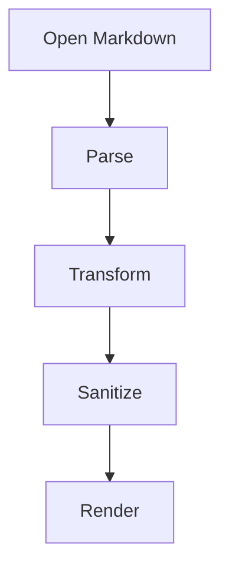

# Markdown Showcase

This document is a visual fixture for the Markdown reader.

## Paragraphs and Inline Styles

Markdown should render **strong text**, *emphasis*, ~~strikethrough~~, `inline code`, and [links](https://example.com) beautifully.

Autolinks should work: https://github.com and contact@example.com.

## Lists

- First item
- Second item
  - Nested item
  - Another nested item
- Third item

1. Ordered item
2. Ordered item
   1. Nested ordered item
   2. Nested ordered item

## Task List

- [x] Render headings
- [x] Render tables
- [ ] Render Mermaid
- [ ] Render DESIGN.md token galleries

## Quote

> A plain blockquote should be distinct from an alert.
> It should feel quiet and readable.

## GitHub Alerts

> [!NOTE]
> Useful information that users should know, even when skimming.

> [!TIP]
> Helpful advice for doing things better or more easily.

> [!IMPORTANT]
> Key information users need to know to achieve their goal.

> [!WARNING]
> Urgent info that needs immediate user attention to avoid problems.

> [!CAUTION]
> Advises about risks or negative outcomes.

## Code

```ts
type MarkdownDocument = {
  path: string
  content: string
  frontMatter?: Record<string, unknown>
}

export function titleFromDocument(doc: MarkdownDocument): string {
  return doc.frontMatter?.title?.toString() ?? doc.path.split('/').pop() ?? 'Untitled'
}
```

```diff
- raw browser default Markdown
+ beautiful reader components
```

## Table

| Feature | Priority | Notes |
|---|---:|---|
| GFM | P0 | Tables, tasks, footnotes, autolinks |
| GitHub alerts | P1 | Note, Tip, Important, Warning, Caution |
| Mermaid | P1 | Sandboxed renderer |
| Math | P1 | KaTeX preferred |
| DESIGN.md | P1 | Token galleries and lint |

## Mermaid



## Math

Inline math: $E = mc^2$

Display math:

$$
\int_0^1 x^2 dx = \frac{1}{3}
$$

## Footnote

This sentence has a footnote.[^1]

[^1]: This is the footnote content with **Markdown** inside.

## Image


## Details

<details>
<summary>Expandable section</summary>

This should be allowed only if raw HTML policy permits safe `details` and `summary`.

</details>
